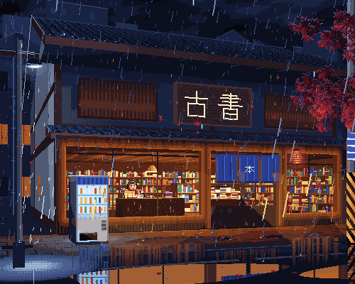
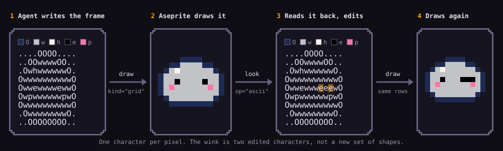

<div align="center">



# Aseprite AI Artist

### Your coding agent, painting in the Aseprite window you already have open.

Not a generated PNG. Not a file changed behind your back.
The document on your screen, one pixel at a time — and every step is one Ctrl+Z.

[](https://www.npmjs.com/package/@pebbly/aseprite-ai-artist)
[](https://github.com/with-pebbly/aseprite-ai-artist/actions/workflows/ci.yml)
[](LICENSE)

<sub>☔ 500×400 · 384 frames at 24 fps · 16 s · 23 layers — drawn by <b>Claude Opus 5.5</b> through this server.</sub>

**[Install](#-install)** · **[How it draws](#-how-it-draws)** · **[Skills](#-skills)** · **[Gallery](https://pixeli.pebbly.space/)**

</div>

---

## ✨ What it feels like

> *"Draw me a 32×32 knight in the PICO-8 palette, then give him a 4-frame idle."*

You type that, and watch it happen in Aseprite: a palette, a silhouette, shading,
layers, a breathing idle, a tagged cycle. The agent **looks at its own work**
after every step, and at the end tells you what it compromised on.

You stay in charge. Don't like the helmet? Ctrl+Z, or just say so.

Works with **Claude Code, omp, Codex CLI, Gemini CLI, Cursor, VS Code and
Windsurf**. Best results so far: **Claude Opus 5.5**.

## 🚀 Install

You need [Aseprite](https://www.aseprite.org/) 1.3+ and Node 22.6+ (macOS, Linux
or Windows).

**1. The Aseprite extension** — then quit and reopen Aseprite:

```bash
npx @pebbly/aseprite-ai-artist install-extension
```

**2. Your agent:**

<details open>
<summary><b>Claude Code</b></summary>

```
/plugin marketplace add with-pebbly/aseprite-ai-artist
/plugin install aseprite@aseprite-ai-artist
```

</details>

<details>
<summary><b>omp</b></summary>

```bash
omp plugin marketplace add with-pebbly/aseprite-ai-artist
omp plugin install aseprite@aseprite-ai-artist
```

</details>

<details>
<summary><b>Codex, Gemini, Cursor, VS Code, Windsurf</b></summary>

```bash
npx @pebbly/aseprite-ai-artist install codex      # or gemini, cursor, --all
```

Your config is backed up first; `--dry-run` shows the change.

</details>

**3. Check it** — restart your agent, then:

```bash
npx @pebbly/aseprite-ai-artist doctor
```

All ticks means you're ready. Updating? Run step 1 again. Odd setups (Steam,
custom folders, Windows paths) are in [docs/INSTALL.md](docs/INSTALL.md).

<details>
<summary><b>No window? Headless mode</b></summary>

For CI or a batch of assets, the server can run Aseprite itself with no window:

```bash
npx @pebbly/aseprite-ai-artist serve --headless --aseprite /path/to/aseprite
```

Nothing is on disk until the agent saves, and it never touches a file your
editor has open. It is never a fallback: if your window isn't attached, the
agent asks instead of quietly switching.

</details>

## 🎨 How it draws

Ask `/aseprite:studio` for anything and it runs the whole job:

| | Stage | What happens |
|---|---|---|
| 1 | **Connect** | Checks Aseprite is attached and reads what's open. If it isn't, it stops — it never edits files behind your back. |
| 2 | **Brief** | Only for open-ended requests: size, palette, view, light — **one** message, one answer. |
| 3 | **Concept** | For anything new: writes the design down and gives you a prompt for an image model. Send back a concept sheet, or say "continue without". |
| 4 | **Draw** | Silhouette first, written as a text grid (below), then shading. |
| 5 | **Animate** | Splits limbs onto layers, plans key poses and timing, draws each frame, tags the cycles. |
| 6 | **Review** | A separate critic who didn't draw it judges the result cold — what does it look like to someone never told? Blockers get fixed one at a time; a fix is kept only if the critic, shown both versions blind, prefers it. |
| 7 | **Export** | Spritesheet + atlas, GIF or PNGs for your engine. |

After every step that changed pixels, it **looks** at the result before moving on.

### 🔤 The grid loop

New in 0.5.0. The agent doesn't draw with circles and rectangles — it **types
the frame out**, one character per pixel, and draws that text in one call. To
fix something, it reads the canvas back in the same format and changes only
the characters that are wrong.



It sees the whole shape while writing it, so silhouettes stay even, limbs keep
their length between frames, and an edit never spills into its neighbours.
Animation is the same trick: copy the last frame's rows, move the arm, draw.

Since 0.6.0 every character stands for one palette entry, the same on every
read, so a big canvas can be read and edited in pieces without the letters
changing meaning between them. A grid can be as large as the canvas.

Early signal, not a measurement: with the same model and prompts, the mage
benchmark went 3 → 4/10 and the road 1 → 3/10; the tree stayed at 2
([compare them](https://pixeli.pebbly.space/benchmarks)).

### 📚 The pixel-art knowledge base

The agent doesn't improvise a hand at 16 px or a horse's walk — it looks them up.

**62 rules · ~400 pixel templates · 2006 palettes** — browse them at
**[pixeli.pebbly.space/knowledge](https://pixeli.pebbly.space/knowledge)** 👀

| 🧍 Craft | 🌍 World |
|---|---|
| `0x` **Core** — loop, palette, shading, outlines | `5x` **Creatures** — quadrupeds, birds, monsters |
| `1x` **Technique** — lines, anti-aliasing, dithering | `6x` **Environments** — skies, water, tiles, buildings |
| `2x` **Colour** — hue-shifted ramps, materials, light | `7x` **Objects & 3D** — perspective, isometric, props |
| `3x` **Characters** — anatomy, faces, hands, clothing | `8x` **Effects & UI** — fire, magic, particles, fonts |
| `4x` **Animation** — idle, walk, jumps, attacks | `9x` **Style** — console eras, tells of generated art |

Every rule gives size budgets, a procedure, common mistakes and grid templates
the agent pastes straight onto the canvas. Any MCP client reads them as
`rules://` resources from [`rules/`](rules/).

🎨 **Palettes:** the console classics plus Lospec's 2000 most-downloaded, each
credited — `preset: "endesga-32"`, or just a word of the name.

### 👀 Review by fresh eyes

New in 0.8.0. The agent that drew a sprite is the worst judge of it — it
knows what it meant, so it sees it. `studio` hands the result to
**pixel-critic**, which first writes a cold read (what the picture shows to
someone who was never told), then a scored critique. A draft ships at 7/10
with nothing blocking; below that the agent fixes the one thing named,
snapshotting first. Each fix goes back to the critic as a blind A/B — old and
new under neutral names — and stays only if it wins, so a round can't quietly
make good art worse.

It costs time (roughly one more critique per round) and its effect on
quality is not yet measured — the thirteen experiment runs behind it are in the
[gallery](https://pixeli.pebbly.space/), next to the benchmark rows.

## 🧰 Skills

`studio` picks these for you. Call one directly when you know the step you want
— as `/aseprite:<name>` in Claude Code and omp, or just ask elsewhere.

| Skill | For | Try |
|---|---|---|
| 🎬 **`studio`** | anything — it plans and runs the rest | `/aseprite:studio a fox, 32×32, sleeping loop` |
| 📝 **`brief`** | a vague idea | `/aseprite:brief a cosy tavern keeper` |
| 🖼️ **`concept`** | a design or storyboard before drawing | `/aseprite:concept a fire mage, 4-frame walk` |
| 📄 **`new`** | a fresh document set up right | `/aseprite:new 64×64, PICO-8` |
| 🎨 **`palette`** | colour: a retro look, ramps, cleanup | `/aseprite:palette give this a Game Boy look` |
| ✏️ **`draw`** | making the thing, text included | `/aseprite:draw a fox curled up asleep` |
| 🌗 **`shade`** | flat art that needs light | `/aseprite:shade light from the upper left` |
| 🦴 **`rig`** | splitting a character for animation | `/aseprite:rig split the knight` |
| 🏃 **`animate`** | walk, idle, attack cycles | `/aseprite:animate 8-frame walk cycle` |
| 🧱 **`tileset`** | terrain and autotiles | `/aseprite:tileset grass-to-dirt, 16px` |
| 🔍 **`review`** | an honest critique | `/aseprite:review why does this look off?` |
| 🩹 **`fix`** | changing art without wrecking it | `/aseprite:fix make him more menacing` |
| 📦 **`export`** | files for your engine | `/aseprite:export spritesheet for Godot` |
| 🗂️ **`submit`** | sharing it in the gallery | `/aseprite:submit` |

In Claude Code and omp, four specialists take stages off the main agent:
**palette-smith**, **rig-builder**, **animation-director** and the read-only
**pixel-critic**.

## 🏆 Which model?

<a href="https://pixeli.pebbly.space/benchmarks">
  <picture>
    <source media="(prefers-color-scheme: dark)" srcset="https://pixeli.pebbly.space/leaderboard/dark.svg">
    
  </picture>
</a>

Live from the [benchmark](https://pixeli.pebbly.space/benchmarks): every model
draws the same fixed prompts and is scored against written criteria. Your
model is not on it? [Send us a sprite!](gallery/README.md)

## 🗂️ Gallery and benchmark

Everything drawn with the plugin — with its prompts, models and `.aseprite`
source — is at **[pixeli.pebbly.space](https://pixeli.pebbly.space/)**. The
benchmark puts every model and plugin version through the same three fixed
prompts and scores them against written criteria, and the
[knowledge base](https://pixeli.pebbly.space/knowledge) shows the rulebook
the agents draw by.

Made something? Ask your agent for `/aseprite:submit` — it packages the files
and opens the pull request.

## 🔧 Under the hood

```
your agent  ──MCP──▶  server  ──▶  bridge  ──▶  Aseprite extension
```

- **18 tools, grouped by noun** (`draw`, `look`, `layer`, `frame`, `export`…)
  instead of ninety — every tool costs context on every turn.
  [Reference](docs/TOOLS.md).
- **A knowledge base** in [`rules/`](rules/) — 62 files from line craft to
  walk cycles, with pixel templates — served over MCP, so every client gets the
  same craft knowledge.
- **Safe by default.** Every action is one undo step. With Aseprite detached,
  tools refuse instead of editing files on disk. Everything binds to
  `127.0.0.1`. [Details](docs/ARCHITECTURE.md) · [security](SECURITY.md).

## 🛠️ Development

```bash
pnpm install && pnpm run build
pnpm test                 # TypeScript
pnpm run test:extension   # the Lua handlers, inside a real Aseprite
pnpm gallery:check        # gallery and benchmark data
pnpm web:dev              # the site, locally
```

Read [AGENTS.md](AGENTS.md) before changing anything — it lists the rules that
aren't negotiable and the Lua gotchas that already cost someone a day.

## 📜 Licence

MIT — see [LICENSE](LICENSE). Aseprite is a trademark of Igara Studio S.A.; this
project isn't affiliated with them.

<div align="center"><sub>Made with ☕ and a lot of Ctrl+Z.</sub></div>
