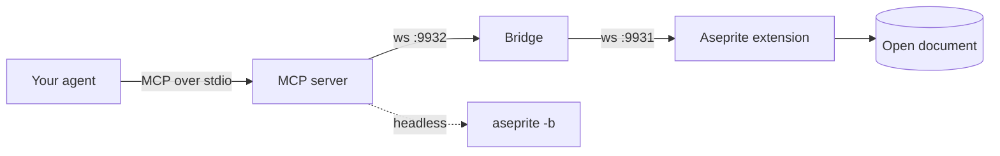

<div align="center">


# Aseprite AI Artist

### Your coding agent, painting in the Aseprite window you already have open.

Not a generated PNG. Not a file changed behind your back.
The document on your screen, one pixel at a time — and every step is one Ctrl+Z.

[](https://www.npmjs.com/package/@pebbly/aseprite-ai-artist)
[](https://github.com/with-pebbly/aseprite-ai-artist/actions/workflows/ci.yml)
[](LICENSE)

<sub>☔ 500×400 · 72 frames · 20 layers · one 50-colour palette — drawn by <b>Claude Opus 5.5</b> through this server.<br>
Rain, wind, lightning, a raccoon stealing a cola, and a reader who sips her coffee and turns the page.<br>
Every moving part runs on a cycle that divides the loop, so it never seams.</sub>

**[Install](#-get-started-in-three-steps)** · **[Skills](#-the-skills-and-how-to-use-them)** · **[Models](#-which-model-should-hold-the-brush)** · **[How it works](#-under-the-hood)**

</div>

---

## ✨ What it feels like

You type a sentence:

> *"Draw me a 32×32 knight in the PICO-8 palette, then give him a 4-frame idle."*

…and you watch it happen in Aseprite. The agent picks a palette, blocks in a
silhouette, **stops to look at what it drew**, shades it with hue-shifted ramps,
splits the knight onto layers, animates him breathing, tags the cycle — and then
tells you honestly what it had to compromise on.

You stay in charge the whole time. Don't like the helmet? Ctrl+Z, or just say so.

It works with **Claude Code, omp, Codex CLI, Gemini CLI, Cursor, VS Code and
Windsurf** — one config line each.

> [!TIP]
> **Recommended model: Claude Opus 5.5.** Right now it's the best brush we've
> handed this server — the scene above is its work.

## 🚀 Get started in three steps

You need [Aseprite](https://www.aseprite.org/) 1.3+ and Node 22.6+ on macOS,
Linux or Windows. Open Aseprite once before you start, so its config folder
exists.

### 1. Install the extension

```bash
npx @pebbly/aseprite-ai-artist install-extension
```

Then **quit and reopen Aseprite**. It only connects at startup, so an editor that
was already running will never find the server.

Updating to a new version? Run the same command again — the extension carries
part of every new feature, and an old one answers new requests with a clear
"not supported" rather than doing half the job.

### 2. Connect your agent

<details open>
<summary><b>Claude Code</b> — install the plugin, not the bare server</summary>

<br>

```
/plugin marketplace add with-pebbly/aseprite-ai-artist
/plugin install aseprite@aseprite-ai-artist
```

You get the server, the `/aseprite:*` commands, four specialist subagents and the
preview hooks. Don't also add the server by hand — you'd load every tool twice,
on every request.

</details>

<details>
<summary><b>omp</b> — the same plugin, through omp's marketplace</summary>

<br>

```bash
omp plugin marketplace add with-pebbly/aseprite-ai-artist
omp plugin install aseprite@aseprite-ai-artist
```

Same server, skills, subagents and `/aseprite:*` commands as Claude Code; the
preview hooks come as an omp extension.

</details>

<details>
<summary><b>Codex, Gemini, Cursor, VS Code, Windsurf</b></summary>

<br>

```bash
npx @pebbly/aseprite-ai-artist install codex      # ~/.codex/config.toml
npx @pebbly/aseprite-ai-artist install gemini     # ~/.gemini/settings.json
npx @pebbly/aseprite-ai-artist install cursor     # ~/.cursor/mcp.json
npx @pebbly/aseprite-ai-artist install --all      # all of the above
```

Your existing config is backed up first. `--dry-run` shows the change without
making it; `--project` writes into the repo instead of your home directory.

</details>

Restart your agent afterwards so it picks up the new server.

### 3. Check it

```bash
npx @pebbly/aseprite-ai-artist doctor
```

Ticks all the way down? You're ready. If something's missing, it tells you
which half — no guessing. More in [docs/INSTALL.md](docs/INSTALL.md).

## 💻 macOS, Linux and Windows

It runs the same on all three. CI builds and tests every commit on
`macos-latest`, `ubuntu-latest` and `windows-latest`.

| | macOS | Linux | Windows |
|---|:---:|:---:|:---:|
| MCP server, bridge, installer, `doctor` | ✅ | ✅ | ✅ |
| Aseprite extension | ✅ | ✅ | ✅ |
| Where `install-extension` looks for Aseprite | `~/Library/Application Support/Aseprite` | `$XDG_CONFIG_HOME/aseprite` (default `~/.config/aseprite`), then `~/.aseprite` | `%APPDATA%\Aseprite` |

Steam, itch.io and self-built Aseprite all use the same config folder as their
platform's standard build. If yours lives somewhere else, point the installer
at it: set `ASEPRITE_USER_FOLDER`, or pass `--dir <path>`.

On Windows the bridge starts as a hidden background process, so no console
window pops up while you draw. Both sockets bind `127.0.0.1` only, so Windows
Firewall has nothing to ask about.

## 🤖 No window? Headless mode

For CI, scripted asset builds or a machine with no display, the server can run
Aseprite itself, in batch mode, instead of driving an open window:

```bash
npx @pebbly/aseprite-ai-artist install codex --headless   # writes ASEPRITE_AI_HEADLESS=1
npx @pebbly/aseprite-ai-artist serve --headless --aseprite /path/to/aseprite
```

Plugin installs (Claude Code, omp) turn it on with `ASEPRITE_AI_HEADLESS=1` in
the environment the agent starts from. The executable comes from `--aseprite`,
then `ASEPRITE_PATH`, then the usual install locations — `doctor` shows which
one it found. No extension or bridge is needed.

It is the same tools on the same command table: one long-lived `aseprite -b`
keeps your documents open in memory between calls, so the active layer, frame
and undo history behave exactly as in the editor. Two differences you will
notice:

- **Nothing is on disk until it is saved.** `sprite_manage` `save`/`save_as`
  and `export` write files; everything else stays in memory and is gone when the
  server stops. `preflight` says so, so the agent saves before it finishes.
- **It never touches a file your Aseprite window has open.** If the editor is
  attached and has that file open, headless `open`, `save` and `save_as` refuse —
  otherwise your next save there would overwrite the work.

`/aseprite:studio` picks the mode from the request — headless for a batch of
files or a build step, the window for anything you want to watch — and
`/aseprite:studio --headless …` (or `--live`) forces it. Under the hood that is
`preflight mode="headless"`; each side keeps its own documents when you switch.
It is never a fallback: if your window isn't attached, the agent asks rather
than quietly going headless. Why, in [ADR-0008](docs/adr/0008-headless-mode.md).

## 🎨 The skills, and how to use them

Skills are the workflows the agent follows — the order an experienced pixel
artist would work in, written down. They're served to every client under the
same names:

| Client | How you call a skill |
|---|---|
| Claude Code, omp | slash command: `/aseprite:draw` |
| Codex, Gemini, Cursor, VS Code, Windsurf | MCP prompt `aseprite:draw`, or just ask — the server's instructions point the agent at the right one |
| Anything else | read `skill://draw` as a resource |

### 🎬 Start here: `aseprite:studio`, the director

**If you remember one skill, make it this one.** `studio` is the orchestrator for
everything else. Hand it any request — big or small — and it:

1. checks Aseprite is attached and reads what's already open;
2. works out what you actually want and writes down the chain of skills it needs;
3. asks you **once**, and only if the request is genuinely open-ended;
4. for anything new, writes the design down first — scenario, palette, poses —
   and hands you **a ready prompt for an image model**. Paste it into ChatGPT,
   Gemini or Midjourney, send back the concept sheet or storyboard, and the agent
   redraws it as pixel art frame by frame; or say "continue without" and it draws
   from the written design alone;
5. runs each stage, handing parts to the specialists where your client has them;
6. **looks** at the result after every stage that changed pixels — side by side
   with the reference when there is one;
7. finishes with a review, fixes what it finds, and reports what exists now.

```
/aseprite:studio an animated knight for my Godot game, 32×32, idle and walk
```

Behind the scenes that becomes `brief → concept → new → palette → draw → shade →
rig → animate → review → export` — and you didn't have to know any of those names.

**Why the image model?** The model drawing pixels is at its worst when it must
invent the character, the pose, the camera and the palette while placing every
pixel. With a concept sheet the job becomes *reproduce this design at 32×32 in
these six colours* — and the reference is a guide for shapes and poses, never
pixels that get downscaled onto the canvas.

### The rest of the toolbox

Reach for these directly when you know exactly which step you want.

| Skill | Use it when… | Try |
|---|---|---|
| 📝 **`brief`** | the idea is still vague. Settles size, palette, view, light and outline in one message before a pixel is drawn. | `/aseprite:brief a cosy tavern keeper` |
| 🖼️ **`concept`** | anything new. Writes the art spec, gives you a prompt for a concept sheet or storyboard, then imports what you send back — one storyboard panel per frame. Also the way in when you already have reference art. | `/aseprite:concept a fire mage, 4-frame walk` |
| 📄 **`new`** | you're starting fresh. Sets up canvas, colour mode, palette and layers so nothing fights you later. | `/aseprite:new 64×64 sprite, PICO-8` |
| 🎨 **`palette`** | colour is the question — a retro look, hue-shifted ramps, cleaning up ninety near-identical browns, or building a tight palette out of the art itself. | `/aseprite:palette give this a Game Boy look` |
| ✏️ **`draw`** | it's time to make the thing. Silhouette first, then materials, shading, outline, verify. Labels and title cards too, in a crisp pixel font — measured first, so they land centred. | `/aseprite:draw a fox curled up asleep` |
| 🌗 **`shade`** | the art looks flat. Adds light and shadow one step at a time, with hue shifting. | `/aseprite:shade light from the upper left` |
| 🦴 **`rig`** | a character is about to move. Splits it onto head, torso, arm and leg layers — `left/arm` and `right/arm` can share a name. | `/aseprite:rig split the knight for animation` |
| 🏃 **`animate`** | something needs to move. Key poses first, timing that breathes, tagged cycles. Checks each in-between over onion-skin ghosts; a cape's drift or a lantern's sway can be generated instead of hand-placed. | `/aseprite:animate 8-frame walk cycle` |
| 🧱 **`tileset`** | you need terrain or level art — seamless tiles, autotiles, Tiled/Godot export. | `/aseprite:tileset grass-to-dirt autotile, 16px` |
| 🔍 **`review`** | you want the truth. Mechanical checks plus eyes-on checks, reported with evidence — including rules you set, like "the sword never covers the face". | `/aseprite:review why does this look off?` |
| 🩹 **`fix`** | something exists and needs changing without wrecking what's already right. | `/aseprite:fix make him look more menacing` |
| 📦 **`export`** | it's done and has to leave Aseprite — spritesheets with JSON atlases, GIFs, scaled PNGs, nine-slice panels and pivot points for your engine. | `/aseprite:export spritesheet for Godot` |
| 🗂️ **`submit`** | you want your sprite in the public gallery or the benchmark. Exports the files, writes an honest `generation.yaml`, checks it and opens the pull request — after asking you. | `/aseprite:submit` |

### 🧑‍🎨 The specialists

In Claude Code and omp, `studio` can hand a stage to one of four subagents.
Each reads the same rulebook, so the result is the same whether it or the main
agent does the work — they just keep the main conversation lighter.

| Agent | What it owns |
|---|---|
| **palette-smith** | proposes a palette and explains why it fits |
| **rig-builder** | plans and builds the layer rig |
| **animation-director** | key poses, timing and tags before a frame is drawn |
| **pixel-critic** | a scored, located critique — read-only, never touches your sprite |

## 🏆 Which model should hold the brush?

Not a benchmark — an honest log of what drew the art on this page. Models we
haven't tried are marked untested rather than guessed at. For repeatable,
scored runs instead of a log entry, see [the gallery and benchmark](#-the-gallery-and-the-benchmark).

| Model | What it drew | How it went |
|---|---|---|
| **Claude Opus 5.5** | the rainy bookshop up top | Best so far. 500×400, 72 frames, 20 layers in one session — plus a few rounds of user notes (café table, hoodie, an arm rig redone with fixed-length IK, lightning, raccoon). |
| **Claude Fable 5.1** | the robot at the easel, below | Very strong. One session, no review passes needed. |
| **Codex CLI** `gpt-5.6-terra`, high reasoning | the harbour below, and the mascot | Strong, but it took five rounds of critique. |
| **Claude Opus 5** | the server, the rulebook, every review pass | The planner and the critic. Its own drawing attempt got scrapped. |
| Gemini 3 Pro, Sonnet 5, Cursor, others | — | Untested. Run one and [send us the sprite](gallery/README.md)! |

<div align="center">
<br>
<sub><i>our mascot — Codex, from the brief and the rulebook alone</i></sub>
</div>

**Method mattered more than the model.** Every good result came the same way:

- **Generate, don't hand-place.** Write a small program that emits every frame,
  then push it. Placing pixels one call at a time by eye is where weak attempts
  died.
- **Look at frames full-size, one at a time.** A filmstrip is a trap — at that
  size you see what you already expect to be there.
- **Turn reasoning up** before you blame the model. A 32×32 grid is a spatial
  problem.

## 💡 Why this one

🌍 **It works everywhere, not just in Claude Code.** Most Aseprite MCP projects
keep their craft knowledge inside a Claude Code plugin, so Codex and Cursor get
raw tools and none of the discipline. Here the rules and skills are served over
MCP, so every client reads the same source of truth.

🪶 **Eighteen tools, not ninety.** Every tool schema sits in the model's context
on every turn, drawing or not. Grouping by noun with an `op` enum covers the same
ground at a sixth of the cost — and makes batching the default, so one `draw`
call is one undo step for you.

👀 **It has to look at its own work.** `look` gives the agent an upscaled
preview, a one-glyph-per-pixel text grid, a filmstrip, an onion skin, a
frame-to-frame diff and a side-by-side against the reference it is drawing
from. `validate` then checks the sprite mechanically before
anything is called done.

🔤 **It can write pixels as text.** A `draw` `grid` is the sprite typed out row
by row — one character per pixel, a legend for the colours — the same format
`look` returns. The agent reads the canvas, edits the rows and draws them back,
instead of guessing coordinates for forty separate shapes.

🛡️ **It can't quietly wreck your file.** With Aseprite detached, every tool
refuses immediately instead of timing out — because an agent that "recovers" by
editing the `.aseprite` on disk makes changes you never see, and your next save
overwrites them.

There's [a whole page](docs/RESEARCH.md) on the other projects in this space, and
where they're still better.

## 🔧 Under the hood

**Eighteen tools**, grouped by noun — `preflight` · `sprite_info` ·
`sprite_manage` · `look` · `read_pixels` · `draw` · `select` · `transform` ·
`recolor` · `layer` · `frame` · `tag` · `cel` · `palette` · `validate` ·
`reference` · `export` · `tileset`, plus `run_lua` as an escape hatch, off by
default. Full reference: [docs/TOOLS.md](docs/TOOLS.md).

**A rulebook** in [`rules/`](rules/) — palette discipline, hue-shifted shading,
silhouette, outlines, animation timing, layer rigging, the review checklist.
Skills point at rules instead of restating them, so each rule has exactly one
place to be wrong.



What one drawing turn goes through:

| Stage | Tool | What happens |
|---|---|---|
| Check | `preflight`, `sprite_info` | Refuses unless Aseprite is attached; reads layers, frames, palette |
| Draw | `draw` | Shapes, fills, dithers — or a `grid`: pixels typed as text rows with a legend |
| Look | `look` | Upscaled preview to judge the read; `ascii` returns the same text grid, so the agent can edit it and draw it back |
| Fix | `recolor`, `transform`, `select` | Palette-legal edits scoped to a region or selection |
| Check again | `validate` | Off-palette colours, stray pixels, broken outlines, banding |
| Ship | `export` | PNG, GIF, spritesheet + atlas, per layer or per tag |

Each call is one transaction — one Ctrl+Z for you.

Aseprite's Lua WebSocket can only be a client, so a small bridge holds the
listening socket. It runs as its own process: restarting the MCP server — which
agent hosts do freely — doesn't drop your Aseprite connection, and a second
agent window can attach without stealing the first one's replies. Details in
[docs/ARCHITECTURE.md](docs/ARCHITECTURE.md).

Both ports bind `127.0.0.1` only. `run_lua` is arbitrary code execution inside
the app holding your unsaved work, so it stays off unless you turn it on — full
threat model in [SECURITY.md](SECURITY.md).

## 🖼️ More, drawn the same way

Everything else people have drawn with the plugin — prompts, models and source
files included — hangs at **[pixeli.pebbly.space](https://pixeli.pebbly.space/)**.

### Who drew what

| Art | Model |
|---|---|
| ☔ Rainy bookshop (hero, `docs/media/rainy-bookshop.gif`) | Claude Opus 5.5 |
| 🐾 Mascot (`docs/media/mascot.png`) | Codex CLI, `gpt-5.6-terra`, high reasoning |

## 🗂️ The gallery and the benchmark

**See them at [pixeli.pebbly.space](https://pixeli.pebbly.space/).**

Every sprite people make with the plugin can go into [`gallery/`](gallery/):
the `.aseprite` source, a cover, the animation, and exactly how it was made —
the prompts in order, the model behind each step, the harness and the plugin
version. The benchmarks are built from the same store: fixed, fully specified
prompts — [a boombox mage's anime attack](gallery/prompts/boombox-mage/prompt.yaml),
[a tree growing from a seed](gallery/prompts/tree-growth/prompt.yaml) and
[a winding-road landscape loop](gallery/prompts/winding-road/prompt.yaml) — each
get one block, with every model × plugin version scored against written
criteria ([how to run them](docs/evals/benchmarks.md)).

Both are published as a site built from [`apps/web`](apps/web/). To add your
own run, finish the sprite and ask your agent for `/aseprite:submit` — it
exports the files, writes `generation.yaml`, checks it and opens the pull
request. The rules are in [gallery/README.md](gallery/README.md); the design is
[ADR-0006](docs/adr/0006-gallery-and-benchmark.md).

## 🛠️ Development

The repository is a pnpm workspace run by turborepo: the plugin is the root
package, [`gallery/`](gallery/) holds the generations, and [`apps/web`](apps/web/)
is the site, [Pixeli](https://pixeli.pebbly.space/).

```bash
pnpm install && pnpm run build
pnpm test                 # TypeScript
pnpm run test:pure        # Lua that needs no editor — what CI runs
pnpm run test:extension   # the real handlers, headless, against a real sprite
pnpm gallery:check        # every generation and benchmark prompt, as CI checks them
pnpm web:dev              # the gallery site on localhost
```

`test:extension` needs Aseprite installed, so CI can't run it. Before changing
anything, read [AGENTS.md](AGENTS.md) — it lists the rules that aren't
negotiable and the Lua gotchas that have already cost someone a day.

## 📜 Licence

MIT — see [LICENSE](LICENSE). Aseprite is a trademark of Igara Studio S.A.; this
project isn't affiliated with them.

<div align="center"><sub>Made with ☕ and a lot of Ctrl+Z.</sub></div>
